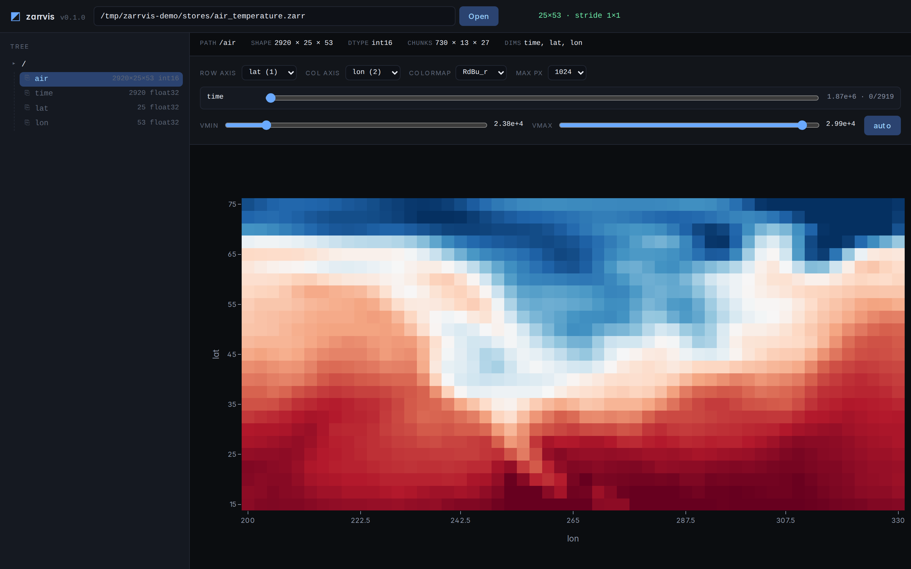
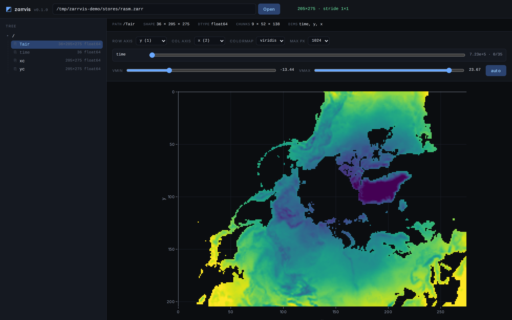
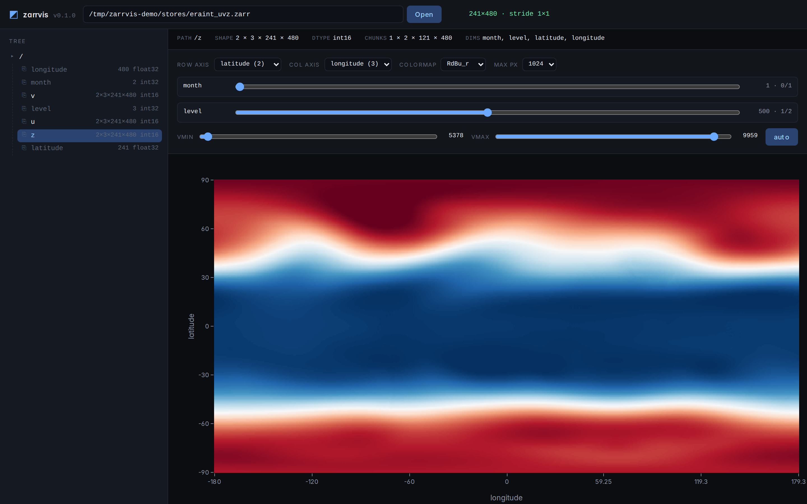
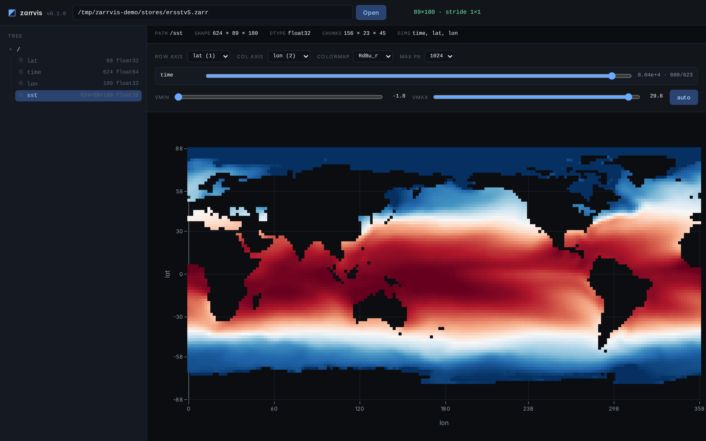

# zarrvis

[](https://github.com/ofgn/zarrvis/actions/workflows/ci.yml)
[](https://www.python.org/downloads/)
[](LICENSE)

A small browser viewer for zarr files. Reads zarr v2 and v3, plain n-D arrays
or labelled [xarray](https://xarray.dev/) /
[OME-Zarr](https://ngff.openmicroscopy.org/) stores. Local paths or remote
`s3://` / `gs://` / `https://` URLs.



## Status

Experimental (v0.1.0). Probably has rough edges. If you hit one, please
[open an issue](https://github.com/ofgn/zarrvis/issues) — a `zarr.tree()`
dump and the `--verbose` traceback are usually enough.

## Install

```bash
uv tool install zarrvis              # local stores
uv tool install 'zarrvis[remote]'    # also s3/gs/https
```

Python 3.12+.

## Use

```bash
zarrvis /path/to/store.zarr
```

Prints a `http://127.0.0.1:…/?token=…` URL and opens your browser. Click an
array in the tree to plot it, drag the sliders to scrub other axes, change
the row / column axis to re-slice. The URL encodes the view, so you can
copy-paste it.

```
zarrvis [PATH] [--host 127.0.0.1] [--port 8765]
        [--root ROOT] [--allow-remote] [--no-browser] [--verbose]
```

`--root` defaults to the parent of `PATH` (or `$HOME`). Remote URLs need
`--allow-remote`.

## Gallery

| RASM Arctic Tair | ERA-Interim 4-D | NOAA ERSST v5 |
|---|---|---|
|  |  |  |
| Regional Arctic surface air temperature, ocean NaN | Global geopotential, sliders over `month` and `level` | Global sea-surface temperature, land NaN |

All four shots are real datasets pulled from the xarray tutorial mirror by
[examples/build_examples.py](examples/build_examples.py). Reproduce with
`uv run scripts/screenshot.py`.

## Supported dtypes

| Kind | Status | Notes |
|---|---|---|
| `float16/32/64` | works | |
| `int*` / `uint*` | works | upcast to float32 on the wire |
| `bool` | works | 0/1 |
| `datetime64` | works | rendered as seconds-since-epoch |
| `complex64/128` | partial | rendered as `\|z\|` |
| `object` / strings | no | tree shows why |

## API

All routes live under `/api/*` and require the session token.

| Route | Returns |
|---|---|
| `GET /api/health` | status, version, allowlist |
| `GET /api/tree?path=…` | groups/arrays with shape, dtype, chunks, dims, attrs |
| `GET /api/slice?path=…&array=…&indices=…&axes=…&max_px=…` | binary frame: `[u32 header_len][json][float32]` |
| `GET /api/stats?…` | percentiles (2/98), min/max, 64-bin histogram |
| `GET /api/coords?path=…&array=…&axis=…` | coord values for an axis |

```python
import httpx, struct, json, numpy as np

r = httpx.get(
    "http://127.0.0.1:8765/api/slice",
    params={"path": "/data/store.zarr", "indices": "[3, null, null]", "token": TOKEN},
)
buf = r.content
(hlen,) = struct.unpack("<I", buf[:4])
header = json.loads(buf[4:4 + hlen])
data = np.frombuffer(buf[4 + hlen:], dtype="float32").reshape(header["rows"], header["cols"])
```

## Security

Built to run on your laptop, not on the open internet.

- Binds `127.0.0.1`.
- Per-session token in every `/api/*` request.
- `Host` header restricted to `localhost` / `127.0.0.1` / `::1`.
- `path` is resolved and checked against `--root`.
- `s3://` / `gs://` / `https://` need `--allow-remote`.

## Development

```bash
git clone https://github.com/ofgn/zarrvis && cd zarrvis
uv sync --all-extras --dev
uv run pytest -q
uv run ruff check . && uv run ruff format --check .
```

See [CONTRIBUTING.md](CONTRIBUTING.md).

## What's next

OME-Zarr multiscale (viewport-aware level pick), an on-disk cache for async
cloud filesystems, PNG export, label-layer overlays.

## License

[MIT](LICENSE). Colormap LUTs are from [matplotlib](https://matplotlib.org/),
see [THIRD_PARTY.md](THIRD_PARTY.md).
